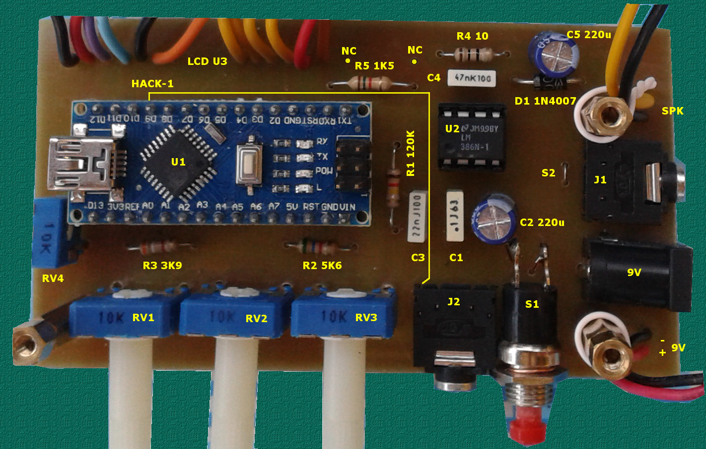

# Mimmo Emulator

"Mimmo emulator" is a **CW Trainer** created by [IW1QLH](http://www.iw1qlh.net).

It's based on ATMega 328 microcontroller, it can be used to receive morse code (only letters, only numbers, mixed, callsign) or to learn to transmit.

Speed: from 5 to 20 WPM (or 15 to 40 WPM)

Space between characters: from 3 dots to 3 seconds

# Files

 - CwTrainer.ino
 - CwTrainer.h

## Schematic

[PCB](cocs/CwTrainer.pdf)

[Bill of materials](docs/BillOfMaterials.txt)

## Boxing

[Drill template for TEKO 362](docs/dima-teko362.pdf)

[Silk-screen for TEKO 362](docs/maschera-teko362.pdf)

# More info

More details [IW1QLH's amateur radio station](https://www.facebook.com/iw1qlh/)
